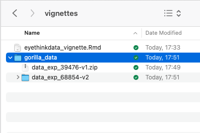
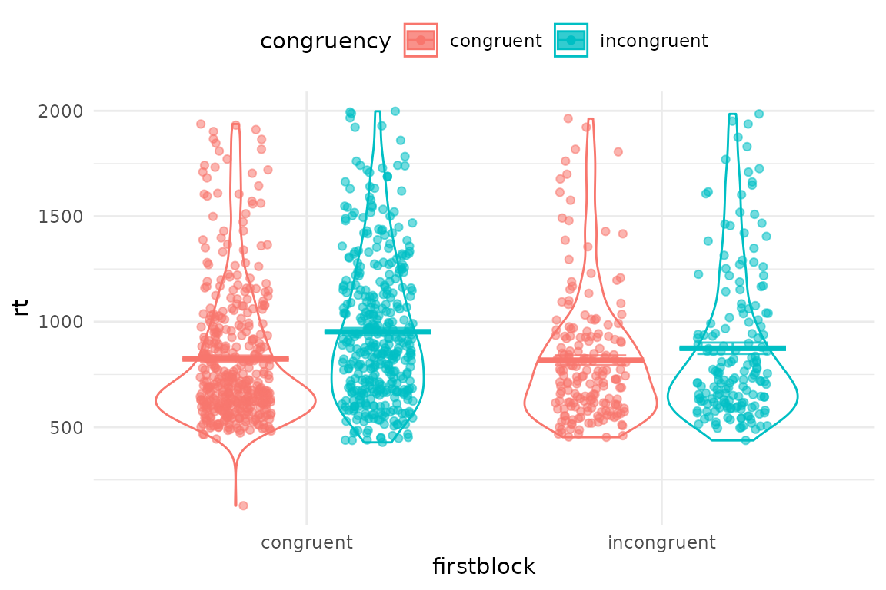
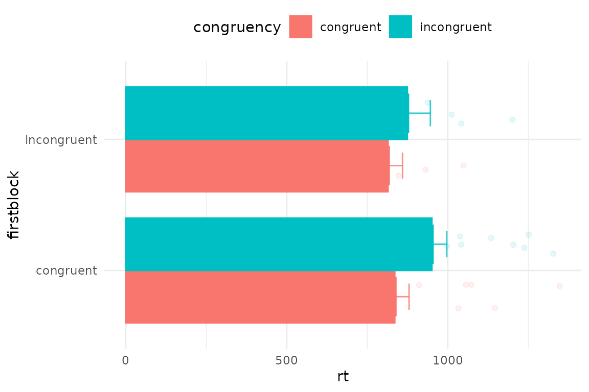
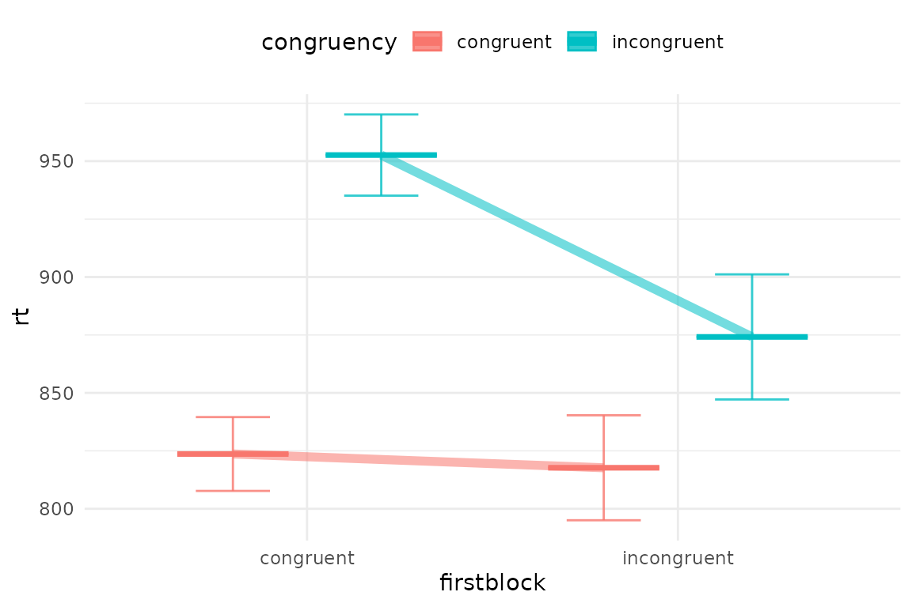
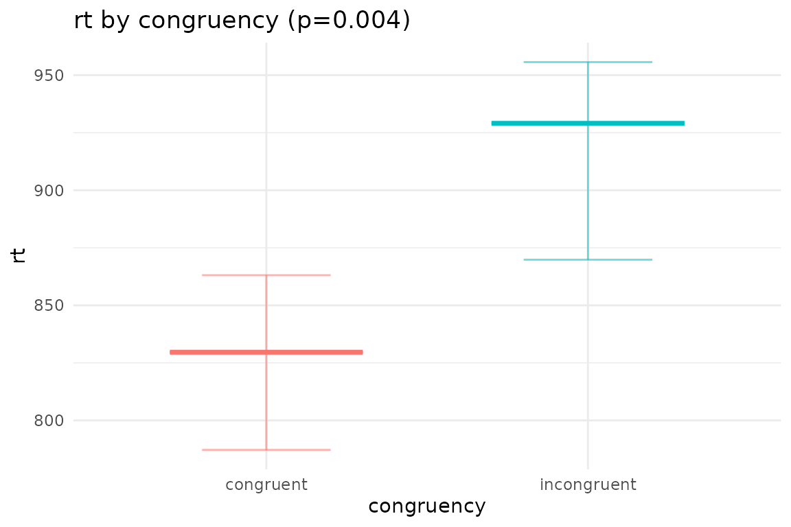
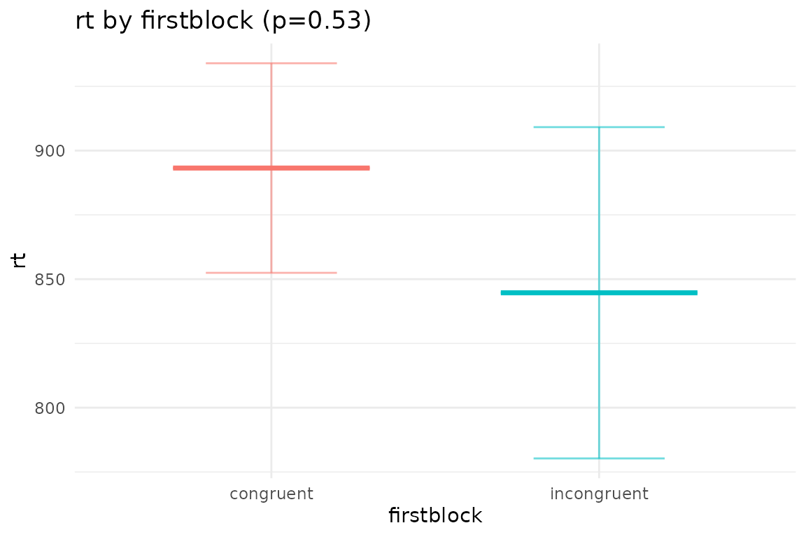
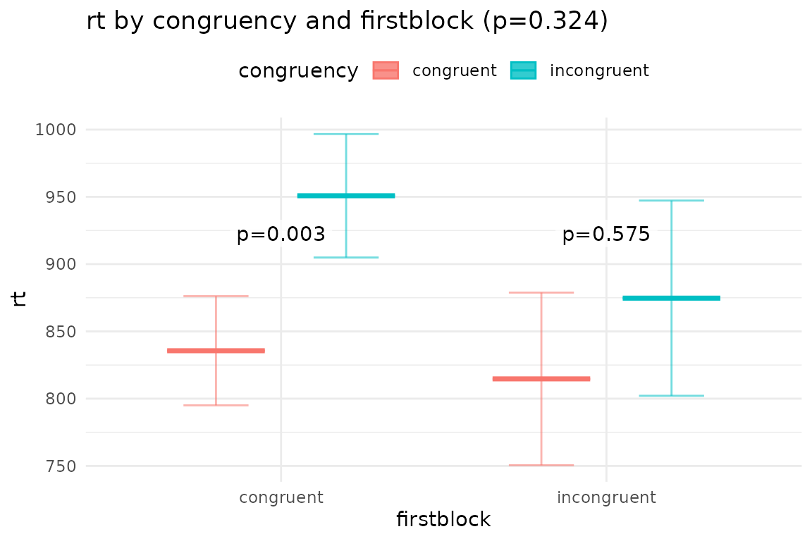

# eyethinkdata_vignette

This is a toolbox for behavioural data. It processes raw downloads from
gorilla, preps behavioural datas for analysis and extracts and scores
information from questionnaires. Performs basic plotting of RDIs (pirate
plots), and correlations from raw data and ANOVAs and mixed models.

Here’s how to get the latest version of the toolbox

``` r
devtools::install_github("dcr-eyethink/eyethinkdata")
```

## Importing data from gorilla

There are several functions all beginning with data\_ that read in
multiple data files and merge them into an R object. The most commonly
used is data_collator_gorilla(). You pass it the name of a folder that
contains downloads from gorilla. These downloads can be .zip files or
unzipped folders that themselves contain gorilla .csv files. For
example:



To run the function, tell it the name of the folder that contains the
downloaded items, or leave it blank and your OS will ask you to choose
the folder.

``` r
library(eyethinkdata)
```

    ## Loading required package: ggplot2

    ## Loading required package: data.table

``` r
data <- data_collator_gorilla("gorilla_data")
```

Remember to give this function a folder that contains other folders that
have the raw data in them. So now you have a list called data that
contains several data.tables.

**data\$data_task** contains all of the data from you gorilla tasks, the
blue blobs in your experiment. This is the raw data from gorilla all
collated together, with a few other columns added. For example, **pid**
is the participant identity (anonymized). **rt** is the reaction time
column.

``` r
knitr::kable( head(data$data_task),)
```

| pid     | lid      | filename                        | Event.Index | UTC.Timestamp | UTC.Date.and.Time   | Local.Timestamp | Local.Timezone | Local.Date.and.Time | Experiment.ID | Experiment.Version | Tree.Node.Key | Repeat.Key | Schedule.ID | Participant.Public.ID | Participant.Private.ID | Participant.Starting.Group | Participant.Status | Participant.Completion.Code | Participant.External.Session.ID | Participant.Device.Type | Participant.Device | Participant.OS | Participant.Browser | Participant.Monitor.Size | Participant.Viewport.Size | Checkpoint | Room.ID | Room.Order | Task.Name      | Task.Version | Spreadsheet  | Trial.Number | Screen.Number | Screen.Name | Zone.Name | Zone.Type         | Reaction.Time | Response | Attempt | Correct | Incorrect | Dishonest | X.Coordinate | Y.Coordinate | Timed.Out | Spreadsheet.Name | randomise_blocks | display          | randomise_trials | ImageLeft | ImageRight | ImageCentre | TextLeft | TextRight | TextCentre | Answer | OrLeft | OrRight | TextLeft1 | TextRight1 | TextRight2 | TextLeft2 |   X | metadata       | metadata.1     |        rt | UTC.Date | Local.Date | randomiser.g1a6 | randomiser.62yd |
|:--------|:---------|:--------------------------------|:------------|--------------:|:--------------------|----------------:|---------------:|:--------------------|--------------:|-------------------:|:--------------|:-----------|------------:|:----------------------|-----------------------:|:---------------------------|:-------------------|:----------------------------|:--------------------------------|:------------------------|:-------------------|:---------------|:--------------------|:-------------------------|:--------------------------|:-----------|:--------|:-----------|:---------------|-------------:|:-------------|:-------------|--------------:|:------------|:----------|:------------------|--------------:|:---------|--------:|--------:|----------:|----------:|:-------------|:-------------|:----------|:-----------------|-----------------:|:-----------------|-----------------:|:----------|:-----------|:------------|:---------|:----------|:-----------|:-------|:-------|:--------|:----------|:-----------|:-----------|:----------|----:|:---------------|:---------------|----------:|:---------|:-----------|:----------------|:----------------|
| 2874231 | 0dxt32ut | data_exp_39476-v1_task-3fjs.csv | 1           |  1.611753e+12 | 27/01/2021 13:06:09 |    1.611753e+12 |              0 | 27/01/2021 13:06:09 |         39476 |                  1 | task-3fjs     | NA         |     9432363 | 0dxt32ut              |                2874231 | NA                         | complete           | NA                          | NA                              | computer                | Desktop or Laptop  | Mac OS 11.1.0  | Chrome 88.0.4324.96 | 1440x900                 | 1434x638                  | NA         | NA      | NA         | IAT_sex_topics |            3 | Spreadsheet1 | BEGIN TASK   |            NA | NA          | NA        | NA                |            NA | NA       |      NA |       0 |         1 |         0 | NA           | NA           | NA        | NA               |               NA | NA               |               NA | NA        | NA         | NA          | NA       | NA        | NA         | NA     | NA     | NA      | NA        | NA         | NA         | NA        |  NA | NA             | NA             |        NA | NA       | NA         | NA              | NA              |
| 2874231 | 0dxt32ut | data_exp_39476-v1_task-3fjs.csv | 2           |  1.611753e+12 | 27/01/2021 13:06:18 |    1.611753e+12 |              0 | 27/01/2021 13:06:18 |         39476 |                  1 | task-3fjs     | NA         |     9432363 | 0dxt32ut              |                2874231 | NA                         | complete           | NA                          | NA                              | computer                | Desktop or Laptop  | Mac OS 11.1.0  | Chrome 88.0.4324.96 | 1440x900                 | 1434x638                  | NA         | NA      | NA         | IAT_sex_topics |            3 | Spreadsheet1 | 1            |             1 | Screen 1    | button    | continue_button   |      8867.000 | NA       |      NA |       0 |         1 |         0 | NA           | NA           | NA        | Spreadsheet1     |               NA | task description |               NA | NA        | NA         | NA          | NA       | NA        | NA         | NA     | NA     | NA      | NA        | NA         | NA         | NA        |   1 | NA             | NA             |  8867.000 | NA       | NA         | NA              | NA              |
| 2874231 | 0dxt32ut | data_exp_39476-v1_task-3fjs.csv | 3           |  1.611753e+12 | 27/01/2021 13:06:34 |    1.611753e+12 |              0 | 27/01/2021 13:06:34 |         39476 |                  1 | task-3fjs     | NA         |     9432363 | 0dxt32ut              |                2874231 | NA                         | complete           | NA                          | NA                              | computer                | Desktop or Laptop  | Mac OS 11.1.0  | Chrome 88.0.4324.96 | 1440x900                 | 1434x638                  | NA         | NA      | NA         | IAT_sex_topics |            3 | Spreadsheet1 | 1            |             1 | Screen 1    | button    | continue_keyboard |     16378.165 | NA       |      NA |       0 |         1 |         0 | NA           | NA           | NA        | Spreadsheet1     |               NA | instructions     |               NA | NA        | NA         | NA          | NA       | NA        | NA         | NA     | NA     | NA      | NA        | NA         | NA         | NA        |   2 | NA             | NA             | 16378.165 | NA       | NA         | NA              | NA              |
| 2874231 | 0dxt32ut | data_exp_39476-v1_task-3fjs.csv | 4           |  1.611753e+12 | 27/01/2021 13:06:42 |    1.611753e+12 |              0 | 27/01/2021 13:06:42 |         39476 |                  1 | task-3fjs     | NA         |     9432363 | 0dxt32ut              |                2874231 | NA                         | complete           | NA                          | NA                              | computer                | Desktop or Laptop  | Mac OS 11.1.0  | Chrome 88.0.4324.96 | 1440x900                 | 1434x638                  | NA         | NA      | NA         | IAT_sex_topics |            3 | Spreadsheet1 | 1            |             1 | Screen 1    | Zone9     | continue_keyboard |      7291.585 | NA       |      NA |       0 |         1 |         0 | NA           | NA           | NA        | Spreadsheet1     |               NA | prepare1         |               NA | NA        | NA         | NA          | NA       | NA        | NA         | NA     | NA     | NA      | female    | male       | NA         | NA        |   3 | practice_words | practice_words |  7291.585 | NA       | NA         | NA              | NA              |
| 2874231 | 0dxt32ut | data_exp_39476-v1_task-3fjs.csv | 5           |  1.611753e+12 | 27/01/2021 13:06:43 |    1.611753e+12 |              0 | 27/01/2021 13:06:43 |         39476 |                  1 | task-3fjs     | NA         |     9432363 | 0dxt32ut              |                2874231 | NA                         | complete           | NA                          | NA                              | computer                | Desktop or Laptop  | Mac OS 11.1.0  | Chrome 88.0.4324.96 | 1440x900                 | 1434x638                  | NA         | NA      | NA         | IAT_sex_topics |            3 | Spreadsheet1 | 1            |             1 | Screen 1    | Zone9     | response_keyboard |      1059.960 | right    |       1 |       1 |         0 |         0 | NA           | NA           | NA        | Spreadsheet1     |               NA | trials           |                1 | NA        | NA         | NA          | NA       | NA        | Jeffrey    | right  | NA     | NA      | female    | male       | NA         | NA        |  14 | practice_words | practice_words |  1059.960 | NA       | NA         | NA              | NA              |
| 2874231 | 0dxt32ut | data_exp_39476-v1_task-3fjs.csv | 6           |  1.611753e+12 | 27/01/2021 13:06:44 |    1.611753e+12 |              0 | 27/01/2021 13:06:43 |         39476 |                  1 | task-3fjs     | NA         |     9432363 | 0dxt32ut              |                2874231 | NA                         | complete           | NA                          | NA                              | computer                | Desktop or Laptop  | Mac OS 11.1.0  | Chrome 88.0.4324.96 | 1440x900                 | 1434x638                  | NA         | NA      | NA         | IAT_sex_topics |            3 | Spreadsheet1 | 1            |             2 | Screen 2    | fixation  | fixation          |       699.972 | NA       |      NA |       0 |         1 |         0 | NA           | NA           | NA        | Spreadsheet1     |               NA | trials           |                1 | NA        | NA         | NA          | NA       | NA        | Jeffrey    | right  | NA     | NA      | female    | male       | NA         | NA        |  14 | practice_words | practice_words |   699.972 | NA       | NA         | NA              | NA              |

There is another data.table called **data\$data_q** which has all the
info from your experiment questionnaires. we will deal with that in the
**questionnaire data** section below. Note that you can download
questionnaire data from gorilla website in wide (one row per person) or
long format. Whichever you choose, this function will compile your data
from different questionnaires, adding more columns for the wide format,
and more rows for the long. The type is also returned in **data_qtype**.
Wide format might be more useful if you are going to immediately analyse
the data yourself, especially if using excel or SPSS. If you are going
to do more processing using eyethinkdata or other r functions, then
choose long format and look at the setions below.

Finally, if you used the mouse or eye tracking plugins, that data will
be in **data\$data_continuous**

## Task data - extracting stimuli, conditions and behaviour

We’re going to extract, plot and analyse data from an example IAT
experiment. Your first step in analysing your data will be to pick out
the rows and columns you want for your experiment. These will contain
information about the trial conditions and stimuli, and information
about the participants’ responses. First we identify the rows that have
the key events, then we pick the columns that have the important
information. Here’s how I would filter the IAT data

``` r
iat_data <-  data$data_task[metadata %in% c("congruent","incongruent") & # row selection
                              Attempt==1 & display=="trials",  # row selection
                             .(pid, trial=Trial.Number, # columns  
                               congruency=metadata,accuracy=Correct,rt,   # columns    
                               item=paste0(na.omit(ImageCentre),na.omit(TextCentre)))]          
# figure out what block came first for each person
iat_data[,firstblock:=.SD[c(1)]$congruency,by=pid] 
knitr::kable(head(iat_data))
```

| pid     | trial | congruency | accuracy |      rt | item     | firstblock |
|:--------|:------|:-----------|---------:|--------:|:---------|:-----------|
| 2874231 | 25    | congruent  |        1 | 747.500 | English  | congruent  |
| 2874231 | 26    | congruent  |        1 | 596.165 | Jeffrey  | congruent  |
| 2874231 | 27    | congruent  |        1 | 586.750 | Emily    | congruent  |
| 2874231 | 28    | congruent  |        1 | 934.665 | Classics | congruent  |
| 2874231 | 29    | congruent  |        1 | 585.710 | Geology  | congruent  |
| 2874231 | 30    | congruent  |        1 | 606.330 | Paul     | congruent  |

### Plotting data

Now we can plot the data with the generic plotting function, pirateye().
You name the columns/conditions that you want to plot on the x axis, and
as a colour contrast.

``` r
pirateye(data=iat_data[accuracy==1 & rt<2000], # trim incorrect trials and outliers
         colour_condition = "congruency",x_condition = "firstblock",dv = "rt")
```



Since we have a dot per trial, this is a bit crowded. You can first
average over people, and also turn elements on and off in pirateye, and
set options such as flipping the coordinates

``` r
pirateye(data=iat_data[accuracy==1 & rt<2000],
         colour_condition = "congruency",x_condition = "firstblock",dv = "rt",
         pid_average = T,  # average over participants' conditions
         violin = F,bar=T,cflip = T)  # no violins but draw some bars and flip axes
```



Or we could connect conditions with lines

``` r
pirateye(data=iat_data[accuracy==1 & rt<2000],
         colour_condition = "congruency",x_condition = "firstblock",dv = "rt",
         dots=F,line=T,violin=F)  # no dots but draw some bars
```



### Plotting ANOVA and mixed models

We can analyse the data with afex aov_ex package, and then plot the
results with plot_model(). This output the ANOVA table and means tables
for all main effects and interactions, and shows post hoc results
comparing the effects of the first named condition over levels of the
second.

``` r
anv <- afex::aov_ez(data=iat_data[accuracy==1 & rt<2000],fun_aggregate = mean,
                    id="pid",between="firstblock",within="congruency",dv="rt")
 plot_model(anv,outp = NULL,bars=F) # you can pass pirateye parameters to this function 
```

    ## 
    ## Univariate Type III Repeated-Measures ANOVA Assuming Sphericity
    ## 
    ##                         Sum Sq num Df Error SS den Df  F value  Pr(>F)    
    ## (Intercept)           34517501      1  1727205     26 519.5995 < 2e-16 ***
    ## firstblock               26906      1  1727205     26   0.4050 0.53007    
    ## congruency               87704      1   223885     26  10.1851 0.00368 ** 
    ## firstblock:congruency     8705      1   223885     26   1.0109 0.32396    
    ## ---
    ## Signif. codes:  0 '***' 0.001 '**' 0.01 '*' 0.05 '.' 0.1 ' ' 1
    ## 
    ## 
    ## Main effects of  congruency 
    ##  congruency  emmean   SE df lower.CL upper.CL
    ##  congruent      825 38.0 26      747      903
    ##  incongruent    913 42.9 26      825     1001
    ## 
    ## Results are averaged over the levels of: firstblock 
    ## Confidence level used: 0.95 
    ##  contrast                estimate   SE df t.ratio p.value
    ##  congruent - incongruent    -87.6 27.4 26  -3.191  0.0037
    ## 
    ## Results are averaged over the levels of: firstblock

    ## 
    ## 
    ## Main effects of  firstblock 
    ##  firstblock  emmean   SE df lower.CL upper.CL
    ##  congruent      893 40.8 26      809      977
    ##  incongruent    845 64.4 26      712      977
    ## 
    ## Results are averaged over the levels of: congruency 
    ## Confidence level used: 0.95 
    ##  contrast                estimate   SE df t.ratio p.value
    ##  congruent - incongruent     48.5 76.2 26   0.636  0.5301
    ## 
    ## Results are averaged over the levels of: congruency

    ## 
    ## 
    ## Interactions of  congruency firstblock 
    ##  congruency  firstblock  emmean   SE df lower.CL upper.CL
    ##  congruent   congruent      836 40.6 26      752      919
    ##  incongruent congruent      951 45.9 26      856     1045
    ##  congruent   incongruent    815 64.2 26      683      947
    ##  incongruent incongruent    875 72.6 26      726     1024
    ## 
    ## Confidence level used: 0.95 
    ##  contrast                                        estimate   SE df t.ratio
    ##  congruent congruent - incongruent congruent       -115.2 29.3 26  -3.926
    ##  congruent congruent - congruent incongruent         20.9 75.9 26   0.276
    ##  congruent congruent - incongruent incongruent      -39.1 83.1 26  -0.470
    ##  incongruent congruent - congruent incongruent      136.1 78.9 26   1.726
    ##  incongruent congruent - incongruent incongruent     76.1 85.8 26   0.887
    ##  congruent incongruent - incongruent incongruent    -60.0 46.4 26  -1.293
    ##  p.value
    ##   0.0030
    ##   0.9925
    ##   0.9650
    ##   0.3312
    ##   0.8117
    ##   0.5753
    ## 
    ## P value adjustment: tukey method for comparing a family of 4 estimates

    ## $model_summary
    ## 
    ## Univariate Type III Repeated-Measures ANOVA Assuming Sphericity
    ## 
    ##                         Sum Sq num Df Error SS den Df  F value  Pr(>F)    
    ## (Intercept)           34517501      1  1727205     26 519.5995 < 2e-16 ***
    ## firstblock               26906      1  1727205     26   0.4050 0.53007    
    ## congruency               87704      1   223885     26  10.1851 0.00368 ** 
    ## firstblock:congruency     8705      1   223885     26   1.0109 0.32396    
    ## ---
    ## Signif. codes:  0 '***' 0.001 '**' 0.01 '*' 0.05 '.' 0.1 ' ' 1
    ## 
    ## $means_congruency
    ##  congruency  emmean   SE df lower.CL upper.CL
    ##  congruent      825 38.0 26      747      903
    ##  incongruent    913 42.9 26      825     1001
    ## 
    ## Results are averaged over the levels of: firstblock 
    ## Confidence level used: 0.95 
    ## 
    ## $plot_congruency



    ## 
    ## $means_firstblock
    ##  firstblock  emmean   SE df lower.CL upper.CL
    ##  congruent      893 40.8 26      809      977
    ##  incongruent    845 64.4 26      712      977
    ## 
    ## Results are averaged over the levels of: congruency 
    ## Confidence level used: 0.95 
    ## 
    ## $plot_firstblock



    ## 
    ## $means_congruency_firstblock
    ##  congruency  firstblock  emmean   SE df lower.CL upper.CL
    ##  congruent   congruent      836 40.6 26      752      919
    ##  incongruent congruent      951 45.9 26      856     1045
    ##  congruent   incongruent    815 64.2 26      683      947
    ##  incongruent incongruent    875 72.6 26      726     1024
    ## 
    ## Confidence level used: 0.95 
    ## 
    ## $plot_congruency_firstblock



Finally, for the IAT there is a function \`gorilla_iatanalysis()\` that
will do all the processing and analysis of task data we’ve done above in
one step.

```
gorilla_iatanalysis(data)
```

## Questionnaire data

There are various functions for processing questionnaire data that all
begin gorill_q. Some are specialised for particular surveys, such as the
TIPI personality test or the BMIS mood scale. Others help code fiddly
things like rank scores or checkboxes.

The basic gorilla_q function just parses the answers to all questions in
a survey and outputs them one row per participant. Gorilla gives you the
text answers in a quanitzed form too. If we don’t need that we can strip
them out with strip=“quant” (or conversely “qual”). If you leave qlist
blank, it will run this through all the task.names in your gorilla
data_q, or you can specifc one questionnaire only.

``` r
gorilla_q_parse(data,qlist = "basic demographics",strip="quant" )
```

    ##          pid    Sex   age
    ##       <fctr> <char> <num>
    ##  1:  3735601   Male    58
    ##  2:  2874231   Male    51
    ##  3:  2878349   Male    53
    ##  4:  2887782 Female    24
    ##  5:  2902933 Female    45
    ##  6:  2906179 Female    22
    ##  7:  2912330 Female    37
    ##  8:  2921282   Male    41
    ##  9:  2921652   Male    38
    ## 10:  3730237 Female    57
    ## 11:  3731661 Female    38
    ## 12:  3734675 Female    51
    ## 13:  3734775 Female    42
    ## 14:  5891983 Female    41
    ## 15: 10068596 Female    23
    ## 16: 10106060 Female    44
    ## 17: 10110660 Female    35
    ## 18: 10107554   Male    29

A more powerful function lets you use a key to score a survey, which is
useful if you have lots of reversed scored items, or subscales to
calculate. We have one, with the gorilla questionnaire name
“Interpersonal Reactivity Index (Davies, 1983)”, so we can name that in
qlist. This will generate a blank survey key and save it in the working
directory in a folder called ‘survey_key’. This is what it looks like.

``` r
gorilla_q_keyed(data,qlist= "Interpersonal Reactivity Index (Davies, 1983)",keyout = T)
```

    ## There is no key for: Interpersonal Reactivity Index (Davies, 1983) 
    ## ... so I put a key for Interpersonal Reactivity Index (Davies, 1983) in working directory for you to edit
    ##                                         Task.Name order Question.Key   sum
    ##                                            <char> <int>       <char> <num>
    ##  1: Interpersonal Reactivity Index (Davies, 1983)     1         EC_1     1
    ##  2: Interpersonal Reactivity Index (Davies, 1983)     2         PT_1     1
    ##  3: Interpersonal Reactivity Index (Davies, 1983)     3         EC_2     1
    ##  4: Interpersonal Reactivity Index (Davies, 1983)     4         PT_2     1
    ##  5: Interpersonal Reactivity Index (Davies, 1983)     5         EC_3     1
    ##  6: Interpersonal Reactivity Index (Davies, 1983)     6         PT_3     1
    ##  7: Interpersonal Reactivity Index (Davies, 1983)     7         EC_4     1
    ##  8: Interpersonal Reactivity Index (Davies, 1983)     8         PT_4     1
    ##  9: Interpersonal Reactivity Index (Davies, 1983)     9         EC_5     1
    ## 10: Interpersonal Reactivity Index (Davies, 1983)    10         EC_6     1
    ## 11: Interpersonal Reactivity Index (Davies, 1983)    11         PT_5     1
    ## 12: Interpersonal Reactivity Index (Davies, 1983)    12         EC_7     1
    ## 13: Interpersonal Reactivity Index (Davies, 1983)    13         PT_6     1
    ## 14: Interpersonal Reactivity Index (Davies, 1983)    14         PT_7     1
    ##       rev scaleName Subscore  qual ignore
    ##     <num>    <char>   <char> <num> <lgcl>
    ##  1:     8      IRID              0     NA
    ##  2:     8      IRID              0     NA
    ##  3:     8      IRID              0     NA
    ##  4:     8      IRID              0     NA
    ##  5:     8      IRID              0     NA
    ##  6:     8      IRID              0     NA
    ##  7:     8      IRID              0     NA
    ##  8:     8      IRID              0     NA
    ##  9:     8      IRID              0     NA
    ## 10:     8      IRID              0     NA
    ## 11:     8      IRID              0     NA
    ## 12:     8      IRID              0     NA
    ## 13:     8      IRID              0     NA
    ## 14:     8      IRID              0     NA

You can then edit it in excel or any text editor, and save it as .csv
file.There is a row for every different survey item in the gorilla
questionnaire, and each row is identified by Question.Key - what you
wrote in the ‘key’ box when making the survey in gorilla. The order
tells you how they appeared in gorilla (NA if they were randomised). You
can change the numbers in the columns sum, ScaleNam, Subscore and qual,
to score/summarize your survey.

Here’s what the columns mean: *sum* - how this item contributes to
scoring: set to 1 to add up, -1 for reverse score. If you enter 0 then
the answer won’t be used to compute score, but instead this answer will
be reported by itself in its own column *rev* - if it is to be reversed
scored, then subtract the answer from this number. eg assuming a 7 point
scale, I’ve set this to 8 as default. *ScaleName* - you will end up with
one row per person and a variable with this name (eg IQ) summarizing all
items. You can have one or many different scales in the same
questionnaire and key *Subscore* - you can break the scales down further
into subscales. Name it here and it will also appear on output as a
scored column (eg IQ_verbal) *qual* - If this item is a non numeric or
qualitative response (eg a text box) then put a 1 here. It won’t be
summarized but till also be reported in output in a column. If this is
*ignore* - If the response matches this answer, then don’t use it in the
scale calculation. This is used, eg for scales where 1-7 is the answer,
but people can also enter 8 for ‘not applicable’.

Here’s a filled out version for our Interpersonal Reactivity Scale key

``` r
read.csv("survey_key complete/Interpersonal Reactivity Index (Davies, 1983).csv")
```

    ##                                        Task.Name Question.Key sum rev scaleName
    ## 1  Interpersonal Reactivity Index (Davies, 1983)         EC_1   1   6      ECPT
    ## 2  Interpersonal Reactivity Index (Davies, 1983)         PT_1  -1   6      ECPT
    ## 3  Interpersonal Reactivity Index (Davies, 1983)         EC_2  -1   6      ECPT
    ## 4  Interpersonal Reactivity Index (Davies, 1983)         PT_2   1   6      ECPT
    ## 5  Interpersonal Reactivity Index (Davies, 1983)         EC_3   1   6      ECPT
    ## 6  Interpersonal Reactivity Index (Davies, 1983)         PT_3   1   6      ECPT
    ## 7  Interpersonal Reactivity Index (Davies, 1983)         EC_4  -1   6      ECPT
    ## 8  Interpersonal Reactivity Index (Davies, 1983)         PT_4  -1   6      ECPT
    ## 9  Interpersonal Reactivity Index (Davies, 1983)         EC_5  -1   6      ECPT
    ## 10 Interpersonal Reactivity Index (Davies, 1983)         EC_6   1   6      ECPT
    ## 11 Interpersonal Reactivity Index (Davies, 1983)         PT_5   1   6      ECPT
    ## 12 Interpersonal Reactivity Index (Davies, 1983)         EC_7   1   6      ECPT
    ## 13 Interpersonal Reactivity Index (Davies, 1983)         PT_6   1   6      ECPT
    ## 14 Interpersonal Reactivity Index (Davies, 1983)         PT_7   1   6      ECPT
    ##    Subscore qual
    ## 1        EC    0
    ## 2        PT    0
    ## 3        EC    0
    ## 4        PT    0
    ## 5        EC    0
    ## 6        PT    0
    ## 7        EC    0
    ## 8        PT    0
    ## 9        EC    0
    ## 10       EC    0
    ## 11       PT    0
    ## 12       EC    0
    ## 13       PT    0
    ## 14       PT    0

Now you can parse and score the questionnaire using the same function.

``` r
gorilla_q_keyed(data,qlist= "Interpersonal Reactivity Index (Davies, 1983)",key_folder = "survey_key complete")
```

    ## Key: <pid>
    ##          pid  ECPT ECPT_EC ECPT_PT
    ##       <fctr> <num>   <num>   <num>
    ##   1: 4193722    40      20      20
    ##   2: 4193708    51      23      28
    ##   3: 4193719    47      21      26
    ##   4: 4217240    43      16      27
    ##   5: 4228549    69      34      35
    ##  ---                              
    ## 126: 4263634    52      29      23
    ## 127: 4263630    57      32      25
    ## 128: 4249143    65      34      31
    ## 129: 4249146    47      24      23
    ## 130: 4228894    57      28      29

You will get an output that has one row per person, and one column that
scores all the answers, and additionally other columns for subscales or
text answers.

## Combining participant and trial data

There is a handy function called \`pid_merge()\` which combines two (or
more) data sets, linking them by the value in pid (by default). You can
use this to add trial data to participant data, or vice versa by passing
two data sets to the function. Below I’ve parsed the demongraphic data
from the IAT, and added to it mean reaction times per condition for each
participant.

``` r
pid_merge(  gorilla_q_parse(data,qlist = "basic demographics",strip = "quant" ),
            dcast(iat_data[accuracy==1],pid~congruency,value.var = "rt",fun.aggregate = mean))
```

    ##          pid    Sex   age congruent incongruent
    ##       <fctr> <char> <num>     <num>       <num>
    ##  1:  3735601   Male    58 1640.5217   1203.3750
    ##  2:  2874231   Male    51  643.6639    853.4889
    ##  3:  2878349   Male    53 1267.3662   1481.7693
    ##  4:  2887782 Female    24  875.6463   1064.9352
    ##  5:  2902933 Female    45  847.1602   1491.3670
    ##  6:  2906179 Female    22  765.9102    727.8968
    ##  7:  2912330 Female    37  649.1347    544.1992
    ##  8:  2921282   Male    41 2045.7631   1566.1163
    ##  9:  2921652   Male    38  808.0895    816.2686
    ## 10:  3730237 Female    57 2135.8733   1529.1154
    ## 11:  3731661 Female    38  664.1135   1047.7798
    ## 12:  3734675 Female    51 1139.0517   1379.3367
    ## 13:  3734775 Female    42 1088.6943   1379.9007
    ## 14:  5891983 Female    41 1125.5261   1449.6227
    ## 15: 10068596 Female    23  628.6100    779.1500
    ## 16: 10106060 Female    44  772.1818    797.4167
    ## 17: 10110660 Female    35  833.3333   1139.2400
    ## 18: 10107554   Male    29  781.2292    937.7167

### Other functions

Other functions in the package will score some standard questionnaires,
explore and plot correlation. If the help info isn;t celar enough, then
raise it as an issue on github and I will add them to this vignette.
