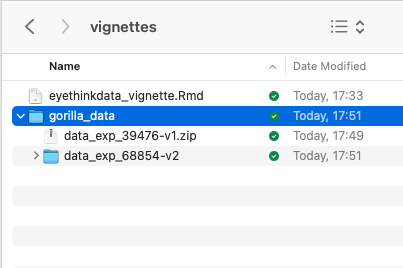

This is a toolbox for behavioural data. It processes raw downloads from gorilla, preps behavioural datas for analysis and extracts and scores information from questionnaires. Performs basic plotting of RDIs (pirate plots), and correlations from raw data and ANOVAs and mixed models.

Here's how to get the latest version of the toolbox

```{r eval=FALSE}
devtools::install_github("dcr-eyethink/eyethinkdata")
```

## Importing data from gorilla

There are several functions all beginning with data\_ that read in multiple data files and merge them into an R object. The most commonly used is data_collator_gorilla(). You pass it the name of a folder that contains downloads from gorilla. These downloads can be .zip files or unzipped folders that themselves contain gorilla .csv files. For example:



To run the function, tell it the name of the folder that contains the downloaded items, or leave it blank and your OS will ask you to choose the folder.

```{r}
library(eyethinkdata)
data <- data_collator_gorilla("gorilla_data")
```

Remember to give this function a folder that contains other folders that have the raw data in them. So now you have a list called data that contains several data.tables.

**data\$data_task** contains all of the data from you gorilla tasks, the blue blobs in your experiment. This is the raw data from gorilla all collated together, with a few other columns added. For example, **pid** is the participant identity (anonymized). **rt** is the reaction time column.

```{r}
knitr::kable( head(data$data_task),)
```

There is another data.table called **data\$data_q** which has all the info from your experiment questionnaires. we will deal with that in the **questionnaire data** section below.  Note that you can download questionnaire data from gorilla website in wide (one row per person) or long format. Whichever you choose, this function will compile your data from different questionnaires, adding more columns for the wide format, and more rows for the long. The type is also returned in **data_qtype**. Wide format might be more useful if you are going to immediately analyse the data yourself, especially if using excel or SPSS. If you are going to do more processing using eyethinkdata or other r functions, then choose long format and look at the setions below.

Finally, if you used the mouse or eye tracking plugins, that data will be in **data\$data_continuous**

## Task data - extracting stimuli, conditions and behaviour

We're going to extract, plot and analyse data from an example IAT experiment. Your first step in analysing your data will be to pick out the rows and columns you want for your experiment. These will contain information about the trial conditions and stimuli, and information about the participants' responses. First we identify the rows that have the key events, then we pick the columns that have the important information. Here's how I would filter the IAT data 

```{r}
iat_data <-  data$data_task[metadata %in% c("congruent","incongruent") & # row selection
                              Attempt==1 & display=="trials",  # row selection
                             .(pid, trial=Trial.Number, # columns  
                               congruency=metadata,accuracy=Correct,rt,   # columns    
                               item=paste0(na.omit(ImageCentre),na.omit(TextCentre)))]          
# figure out what block came first for each person
iat_data[,firstblock:=.SD[c(1)]$congruency,by=pid] 
knitr::kable(head(iat_data))
```

### Plotting data

Now we can plot the data with the generic plotting function, pirateye(). You name the columns/conditions that you want to plot on the x axis, and as a colour contrast.

```{r out.width = "90%", fig.width =6,fig.height =4 }
pirateye(data=iat_data[accuracy==1 & rt<2000], # trim incorrect trials and outliers
         colour_condition = "congruency",x_condition = "firstblock",dv = "rt")
```

Since we have a dot per trial, this is a bit crowded. You can first average over people, and also turn elements on and off in pirateye, and set options such as flipping the coordinates

```{r out.width = "90%", fig.width =6,fig.height =4 }
pirateye(data=iat_data[accuracy==1 & rt<2000],
         colour_condition = "congruency",x_condition = "firstblock",dv = "rt",
         pid_average = T,  # average over participants' conditions
         violin = F,bar=T,cflip = T)  # no violins but draw some bars and flip axes
```

Or we could connect conditions with lines

```{r out.width = "90%", fig.width =6,fig.height =4 }
pirateye(data=iat_data[accuracy==1 & rt<2000],
         colour_condition = "congruency",x_condition = "firstblock",dv = "rt",
         dots=F,line=T,violin=F)  # no dots but draw some bars
```

### Plotting ANOVA and mixed models

We can analyse the data with afex aov_ex package, and then plot the results with plot_model(). This output the ANOVA table and means tables for all main effects and interactions, and shows post hoc results comparing the effects of the first named condition over levels of the second.

```{r out.width = "90%", fig.width =6,fig.height =4, message=FALSE}
anv <- afex::aov_ez(data=iat_data[accuracy==1 & rt<2000],fun_aggregate = mean,
                    id="pid",between="firstblock",within="congruency",dv="rt")
 plot_model(anv,outp = NULL,bars=F) # you can pass pirateye parameters to this function 
```

Finally, for the IAT there is a function \`gorilla_iatanalysis()\` that will do all the processing and analysis of task data we've done above in one step.

``` {reval="FALSE"}
gorilla_iatanalysis(data)
```

## Questionnaire data 

There are various functions for processing questionnaire data that all begin gorill_q. Some are specialised for particular surveys, such as the TIPI personality test or the BMIS mood scale. Others help code fiddly things like rank scores or checkboxes. 

The basic gorilla_q function just parses the answers to all questions in a survey and outputs them one row per participant. Gorilla gives you the text answers in a quanitzed form too. If we don't need that we can strip them out with strip="quant" (or conversely "qual"). If you leave qlist blank, it will run this through all the task.names in your gorilla data_q, or you can specifc one questionnaire only. 

```{r}
gorilla_q_parse(data,qlist = "basic demographics",strip="quant" )
```

A more powerful function lets you use a key to score a survey, which is useful if you have lots of reversed scored items, or subscales to calculate. We have one, with the gorilla questionnaire name "Interpersonal Reactivity Index (Davies, 1983)", so we can name that in qlist. This will generate a blank survey key and save it in the working directory in a folder called 'survey_key'. This is what it looks like.

```{r}
gorilla_q_keyed(data,qlist= "Interpersonal Reactivity Index (Davies, 1983)",keyout = T)
```

You can then edit it in excel or any text editor, and save it as .csv file.There is a row for every different survey item in the gorilla questionnaire, and each row is identified by Question.Key - what you wrote in the 'key' box when making the survey in gorilla. The order tells you how they appeared in gorilla (NA if they were randomised). You can change the numbers in the columns sum, ScaleNam, Subscore and qual, to score/summarize your survey.

Here's what the columns mean:
*sum* - how this item contributes to scoring: set to 1 to add up, -1 for reverse score. If you enter 0 then the answer won't be used to compute score, but instead this answer will be reported by itself in its own column
*rev* - if it is to be reversed scored, then subtract the answer from this number. eg assuming a 7 point scale, I've set this to 8 as default.
*ScaleName* - you will end up with one row per person and a variable with this name (eg IQ) summarizing all items. You can have one or many different scales in the same questionnaire and key
*Subscore*  - you can break the scales down further into subscales. Name it here and it will also appear on output as a scored column (eg IQ_verbal)
*qual* - If this item is a non numeric or qualitative response (eg a text box) then put a 1 here. It won't be summarized but till also be reported in output in a column. If this is 
*ignore* - If the response matches this answer, then don't use it in the scale calculation. This is used, eg for scales where 1-7 is the answer, but people can also enter 8 for 'not applicable'.

Here's a filled out version for our Interpersonal Reactivity Scale key

```{r}
read.csv("survey_key complete/Interpersonal Reactivity Index (Davies, 1983).csv")
```

Now you can parse and score the questionnaire using the same function. 

```{r}
gorilla_q_keyed(data,qlist= "Interpersonal Reactivity Index (Davies, 1983)",key_folder = "survey_key complete")
```

You will get an output that has one row per person, and one column that scores all the answers,
and additionally other columns for subscales or text answers.

## Combining participant and trial data

There is a handy function called \`pid_merge()\` which combines two (or more) data sets, linking them by the value in pid (by default). You can use this to add trial data to participant data, or vice versa by passing two data sets to the function. Below I've parsed the demongraphic data from the IAT, and added to it mean reaction times per condition for each participant.    

```{r}
pid_merge(  gorilla_q_parse(data,qlist = "basic demographics",strip = "quant" ),
            dcast(iat_data[accuracy==1],pid~congruency,value.var = "rt",fun.aggregate = mean))
```

### Other functions

Other functions in the package will score some standard questionnaires, explore and plot correlation. If the help info isn;t celar enough, then raise it as an issue on github and I will add them to this vignette. 
